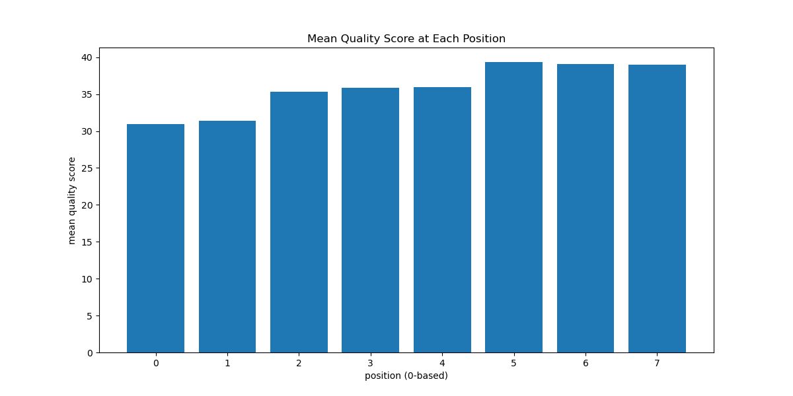
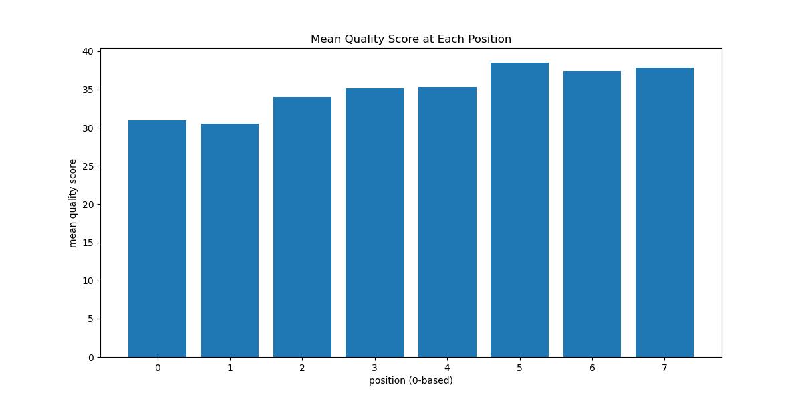
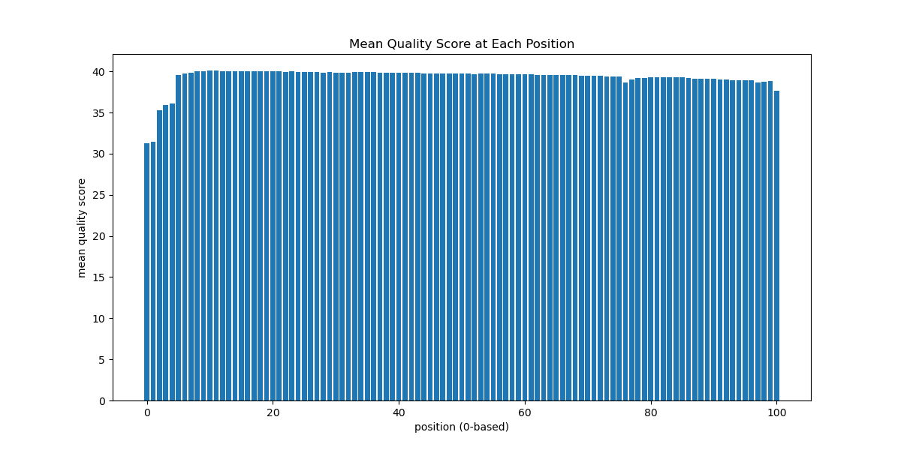
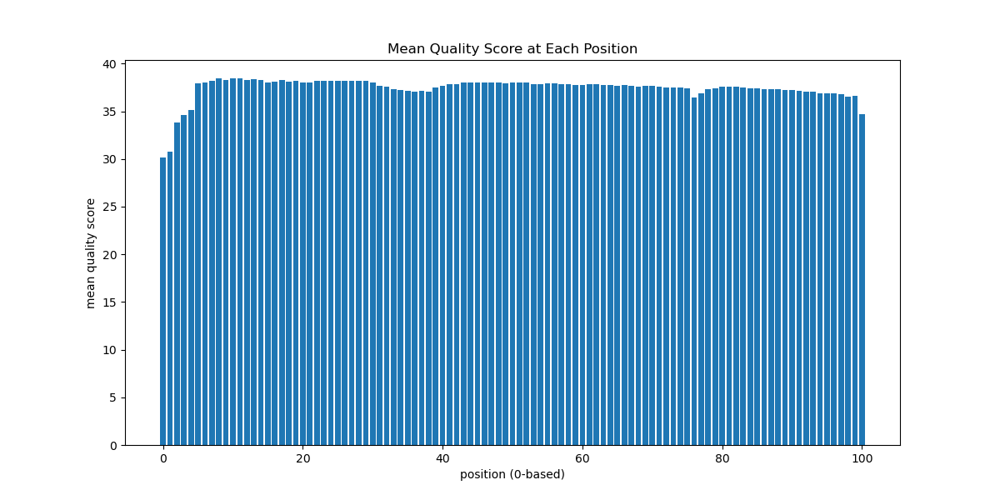

# Assignment the First

## Part 1
1. Be sure to upload your Python script.

| File name | label |
|---|---|
| 1294_S1_L008_R1_001.fastq.gz | read1 |
| 1294_S1_L008_R2_001.fastq.gz | index1 |
| 1294_S1_L008_R3_001.fastq.gz | index2 |
| 1294_S1_L008_R4_001.fastq.gz | read2 |

2. Per-base NT distribution
    1. 
Format: 

Format: 

Format: 

Format: 
    2. For quality scores of indexes, if a single base in the sequence has a qscore less than 20, then consider it low quality. Using a qscore of 20 as the cutoff would mean there must be a 99% probability that each and every base call is correct for it to be used for sample identification. For quality scores of the reads, the standard cutoff seems to be an average qscore of 30 across the read, meaning the average probability that the read has the correct bases must be 99.9% for it to be analyzed downstream.
    3. 7304664 indexes (1.005%) from both index1 and index2 reads have at least 1 N. 
    ```
    $ zcat 1294_S1_L008_R[2,3]_001.fastq.gz | sed -n '2~4p' | grep -c 'N'
    ````


## Part 2
1. Define the problem
2. Describe output
3. Upload your [4 input FASTQ files](../TEST-input_FASTQ) and your [4 expected output FASTQ files](../TEST-output_FASTQ).
4. Pseudocode
5. High level functions. For each function, be sure to include:
    1. Description/doc string
    2. Function headers (name and parameters)
    3. Test examples for individual functions
    4. Return statement
